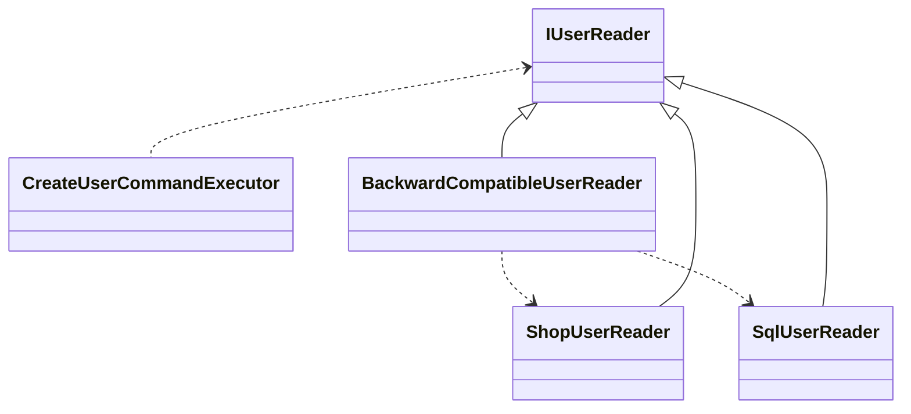

### 데이터베이스 생성
```shell
dotnet ef database update -v

dotnet ef migrations add AddUsers --project Sellers.Sql --startup-project ./Sellers.Api
dotnet ef database update --project Sellers.Sql --startup-project Sellers.Api 

dotnet ef migrations add AddRoles --project ./Sellers/Sellers.Sql --startup-project ./Sellers/Sellers.Api
dotnet ef database update --project Sellers.Sql --startup-project Sellers.Api 
```

