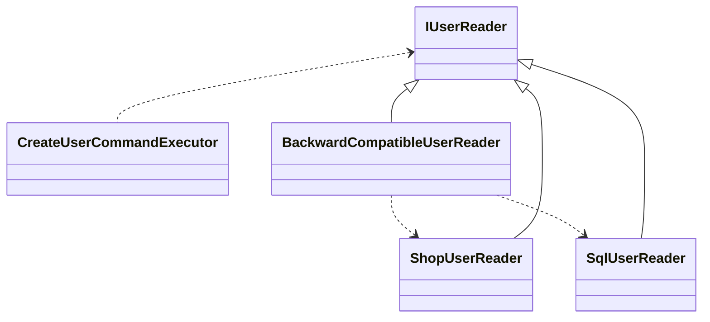

### 데이터베이스 생성
```shell
dotnet ef database update -v

dotnet ef migrations add AddUsers --project Sellers.Sql --startup-project ./Sellers.Api
dotnet ef database update --project Sellers.Sql --startup-project Sellers.Api 

dotnet ef migrations add AddRoles --project ./Sellers/Sellers.Sql --startup-project ./Sellers/Sellers.Api
dotnet ef database update --project Sellers.Sql --startup-project Sellers.Api 
```



## 학습
`using` DB 연결 자동 닫기  
* 객체의 라이프 사이클을 제어하기 위해 사용된다. 코드 블록으로 표현 되며 해당 범위를 벗어나면 자동으로 Dispose 된다.
* `Func<SellersDBContext>` 매 번 호출 되어 DB 연결을 종료 할 수 있다.
    ```
    // SqlUserRepository.cs 소스 
  
    // SqlUserRepository_specs 
    // * Sut_returns_true_if_user_exists
  
    public async Task Add(User user)
    {
        using SellersDbContext context = this.contextFactory.Invoke();
        context.Users.Add(new UserEntity
        {
            Username = user.Username,
            Id = user.Id,
            PasswordHash = user.PasswordHash,
            // Roles = user.Roles,
        });
        await context.SaveChangesAsync();
    }

    public async Task<bool> TryUpdate(Guid id, Func<User, User> reviser)
    {
        using SellersDbContext context = this.contextFactory.Invoke();
        UserEntity? user = await context.Users.SingleOrDefaultAsync(x => x.Id == id);
    
        return user != null;
    }
    ```

